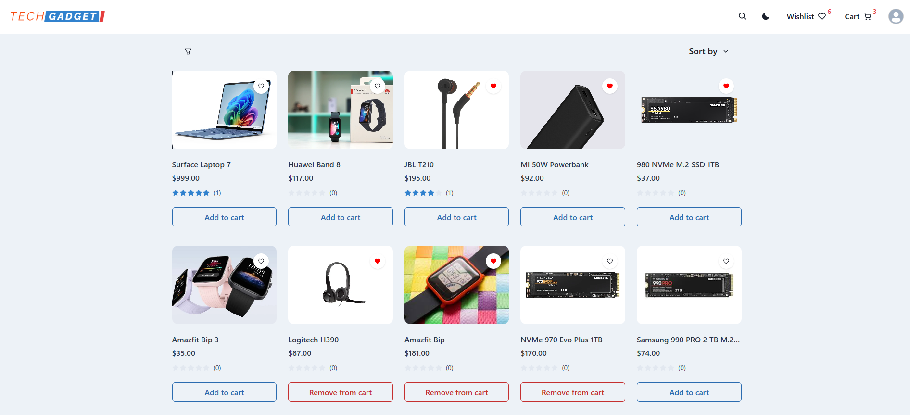

# Ecommerce App using ASP.NET Core and React

## Features

- **Customer Features**:
  - User Account: Register, log in, forgot password and update account(profile picture, username and multiple addresses).
  - Product Browsing: Search, filter, and explore a variety of paginated products.
  - Product Reviews: Rate products and leave descriptive comments to help other customers.
  - Wishlist: Save your favorite products to a wishlist for later.
  - Shopping Cart: Add, update, and remove items in the cart. 
  - Checkout: A simple checkout process to place orders.
- **Admin Features**:
  - Catalog Management: Add, edit, and delete product/category/brand listings.

## Server Side Technologies

- ASP.NET Core
- EF Core
- AWS s3
- Identity Platform
- Jwt with refresh token
- PostgreSQL
- MailKit
- [ErrorOr](https://github.com/amantinband/error-or)

## Client Side Technologies
- React
- Chakra UI
- Axios
- React Query
- Page Lazy Loading
- Dark Theme

## Screenshots

### Catalog

### **Product**

### **Cart**

### **Wishlist**

### **Checkout**

### **Login/Register/ForgotPassword**

### **Account**

